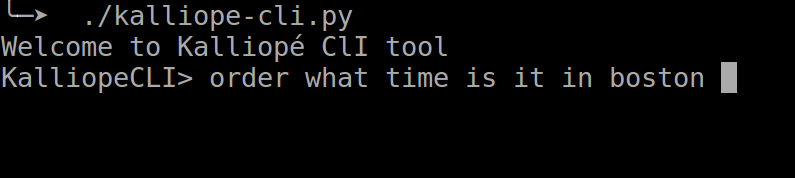

# kalliope-cli
A simple shell to send orders to kalliope via the CLI



[youtube video](https://youtu.be/cQNnZI4n9BI)

Installation

```
git clone https://github.com/bacardi55/kalliope-cli.git
chmod +x kalliope-cli.py
```

Run
```
./kalliope-cli.py
```

Usage: [action] [text]

For now, only ```order <text>``` is available

Todo:

- [x] ~~Send order to kalliope~~
- [ ] Autocomplete (works now but not great)
- [ ] Run by synapse name
- [ ] Add "local" alternative (use --run-order instead of API) for perf
- [ ] Help command
- [ ] List command to list all orders and/or synapse
